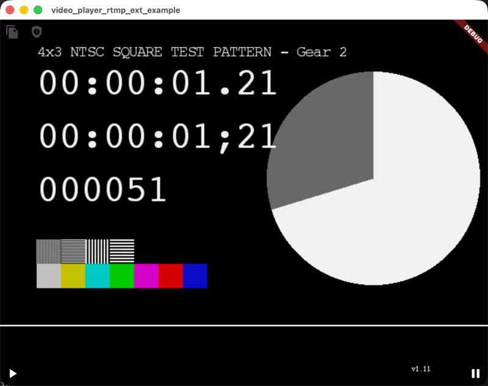
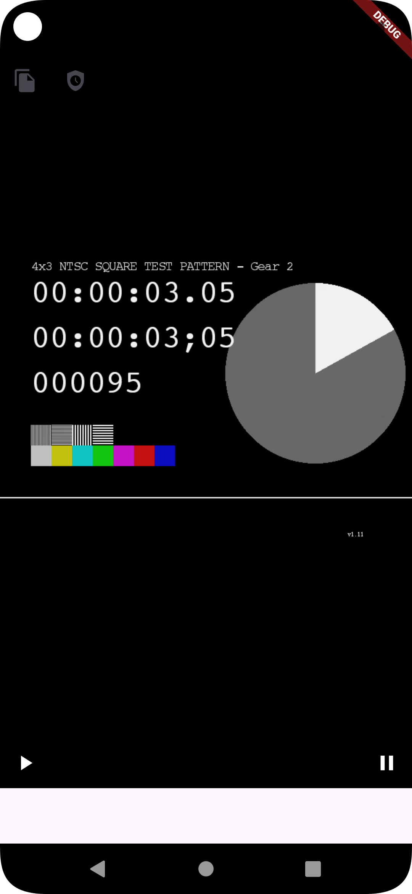

# video_player_rtmp_ext
[](https://pub.dev/packages/video_player_rtmp_ext)
<a href="https://flutter.dev/docs/get-started/install/windows"></a>
<a href="https://jq.qq.com/?_wv=1027&k=Z0AHodXB"></a>

A player supporting rtmp,rtmps,m3u8 live video

Your flutter version must be greater than 
or equal to 3.3.2 to use this plug-in

* Test Link
1. http://devimages.apple.com.edgekey.net/streaming/examples/bipbop_4x3/gear2/prog_index.m3u8
2. rtmp://ns8.indexforce.com/home/mystream
3. rtmp://mobliestream.c3tv.com:554/live/goodtv.sdp

## Getting Started

```yaml
video_player_rtmp_ext: ^last_version
```

##### Android
* in project `build.gradle` add this line
```kotlin
allprojects {
    repositories {
        ...
        maven { url 'https://jitpack.io' }
        maven { url "https://maven.aliyun.com/repository/public" }
    }
}
```

* add `minSdkVersion` set to `19`

* add `android:usesCleartextTraffic="true"` to you `AndroidManifest.xml` file


##### iOS
Update  `youProject/ios/Podfile`
```
target 'Runner' do
  # update this line 
  use_frameworks! :linkage => :static 
  use_modular_headers!
end
```
```
pod install
```


## 1.Simple example





* Initialize controller

```dart
IJKPlayerController controller = IJKPlayerController.network("http://devimages.apple.com.edgekey.net/streaming/examples/bipbop_4x3/gear2/prog_index.m3u8");
```

* Using widgets

```dart
VideoPlayerRtmpExtWidget(
   controller: controller,
   viewCreated: (IJKPlayerController _){
       controller.play();
   },
)
```

## 2. Controller API

* Start
```dart
controller.play();
```

* Pause
```dart
controller.pause();
```

* Stop
```dart
controller.stop();
```

* Resume
```dart
controller.resume();
```

* Judge whether it is playing
```dart
final isPlaying = await controller.isPlaying;
```

* If you want to play the m3u8 video, please add this line
  (only android)
```dart
if(controller.isAndroid){
   await controller.setPlayManager(PlayerFactory.exo2PlayerManager);
}
```

* player state change callback
```dart
controller.addListener(onStateChange);
...
void onStateChange(VideoListenerModel model){
  debugPrint("$model");
  model.when(progress: (progress, secProgress, currentPosition, duration) {
  // todo : Playback progress
  }, playbackState: (playbackState) {
  // todo: Playback state
  }, onPlayError: (error) {
  // todo : error callback detail info
  },);
}

```


## Android release proguard-rules.txt
```
-keep class com.shuyu.gsyvideoplayer.video.** { *; }
-dontwarn com.shuyu.gsyvideoplayer.video.**
-keep class com.shuyu.gsyvideoplayer.video.base.** { *; }
-dontwarn com.shuyu.gsyvideoplayer.video.base.**
-keep class com.shuyu.gsyvideoplayer.utils.** { *; }
-dontwarn com.shuyu.gsyvideoplayer.utils.**
-keep class com.shuyu.gsyvideoplayer.player.** {*;}
-dontwarn com.shuyu.gsyvideoplayer.player.**
-keep class tv.danmaku.ijk.** { *; }
-dontwarn tv.danmaku.ijk.**
-keep class androidx.media3.** {*;}
-keep interface androidx.media3.**

-keep class com.shuyu.alipay.** {*;}
-keep interface com.shuyu.alipay.**

-keep public class * extends android.view.View{
    *** get*();
    void set*(***);
    public <init>(android.content.Context);
    public <init>(android.content.Context, java.lang.Boolean);
    public <init>(android.content.Context, android.util.AttributeSet);
    public <init>(android.content.Context, android.util.AttributeSet, int);
}

-keep class com.alivc.**{*;}
-keep class com.aliyun.**{*;}
-keep class com.cicada.**{*;}
-dontwarn com.alivc.**
-dontwarn com.aliyun.**
-dontwarn com.cicada.**

# Keep Flutter plugin classes
-keep class shop.itbug.video_player_rtmp_ext.VideoPlayerRtmpExtPlugin { *; }
-keep class shop.itbug.video_player_rtmp_ext.ViewFactory { *; }

# Keep all Flutter plugin classes in the package
-keep class shop.itbug.video_player_rtmp_ext.** { *; }

# Suppress warnings for missing classes
-dontwarn shop.itbug.video_player_rtmp_ext.VideoPlayerRtmpExtPlugin

# Suppress warnings for StringConcatFactory used by Kotlin
-dontwarn java.lang.invoke.StringConcatFactory

```
